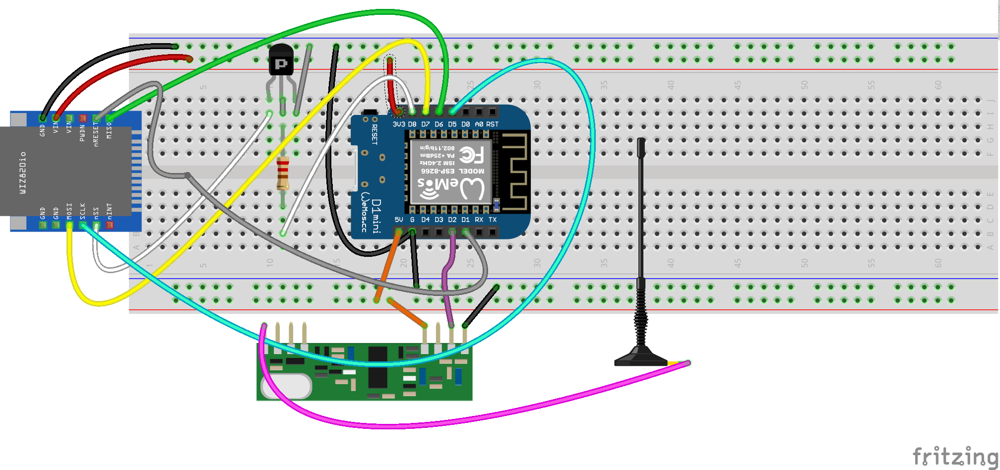

# OregonNR_Esp8266_Eth5500
Oregon Scientific 433 kHz Sensor Gateway to MQTT
via ESP8266 D1 Mini  + RXB8 +  Ethernet W5500 Module

I wanted to re-use my existing WMR88 Station Sensors:
http://weather.oregonscientific.com/products_wmr88.asp

Thanks to "invandy" and this library https://github.com/invandy/Oregon_NR it was a quit low effort to change from WiFi to Ethernet.

I used a hint regarding parallel use of Eth5500 SPI and ESP8266:
https://esp8266hints.wordpress.com/2018/02/13/adding-an-ethernet-port-to-your-esp-revisited/

to connected the HW as shown here:

HW Components are:
* RXB8
* Wemos D1 Mini Lite (ESP8266)
* W5500 SPI Ethernet Modul 

